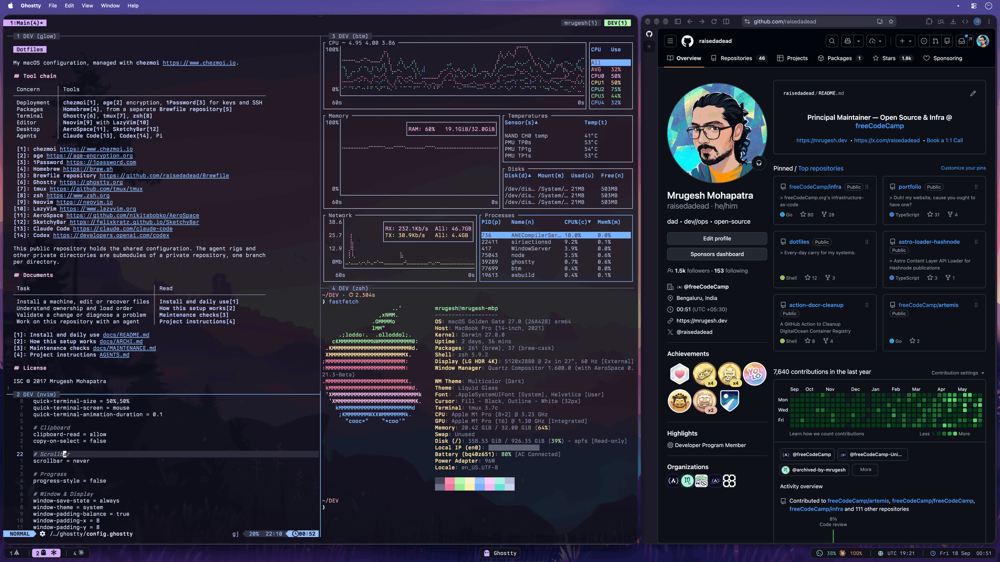

# Dotfiles

[chezmoi](https://www.chezmoi.io) manages my macOS configuration.

## Tool chain

| Concern    | Tools                                                                                                                                |
| ---------- | ------------------------------------------------------------------------------------------------------------------------------------ |
| Deployment | [chezmoi](https://www.chezmoi.io), [age](https://age-encryption.org) encryption, [1Password](https://1password.com) for keys and SSH |
| Packages   | [Homebrew](https://brew.sh), from a separate [Brewfile repository](https://github.com/raisedadead/Brewfile)                          |
| Terminal   | [Ghostty](https://ghostty.org), [tmux](https://github.com/tmux/tmux), [zsh](https://www.zsh.org)                                     |
| Editor     | [Neovim](https://neovim.io) with [LazyVim](https://www.lazyvim.org)                                                                  |
| Desktop    | [AeroSpace](https://github.com/nikitabobko/AeroSpace), [SketchyBar](https://felixkratz.github.io/SketchyBar)                         |
| Agents     | [Claude Code](https://claude.com/claude-code), [Codex](https://developers.openai.com/codex)                                          |

This public repository holds the shared configuration. The two agent rigs and the other private directories are submodules of a private repository, one branch per directory. Read [Agent rigs](docs/ARCHI.md#agent-rigs) for the map.

## Documents

| Task                                     | Read                                      |
| ---------------------------------------- | ----------------------------------------- |
| Install, edit, capture, or recover files | [Install and daily use](docs/README.md)   |
| Understand ownership and load order      | [How this setup works](docs/ARCHI.md)     |
| Validate a change or diagnose a problem  | [Maintenance checks](docs/MAINTENANCE.md) |
| Work on this repository with an agent    | [Project instructions](AGENTS.md)         |

## License

ISC © 2017 Mrugesh Mohapatra
